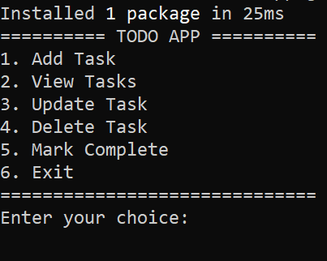
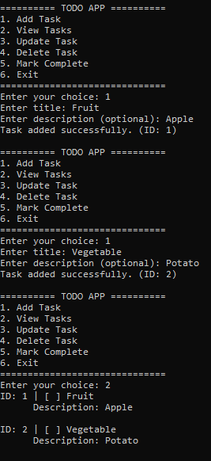

# Todo-In-Memory-Python-Console-App

I created a simple Python console-based to-do app that manages tasks in memory without persistent storage with using  Python 3.13+ for better readability and maintainability , Claude Code CLI for code generation, Spec-kit plus for spec-driven development and UV package manager for python. 

